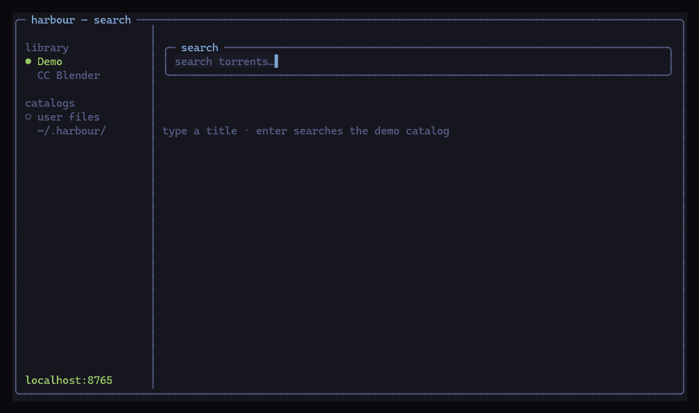
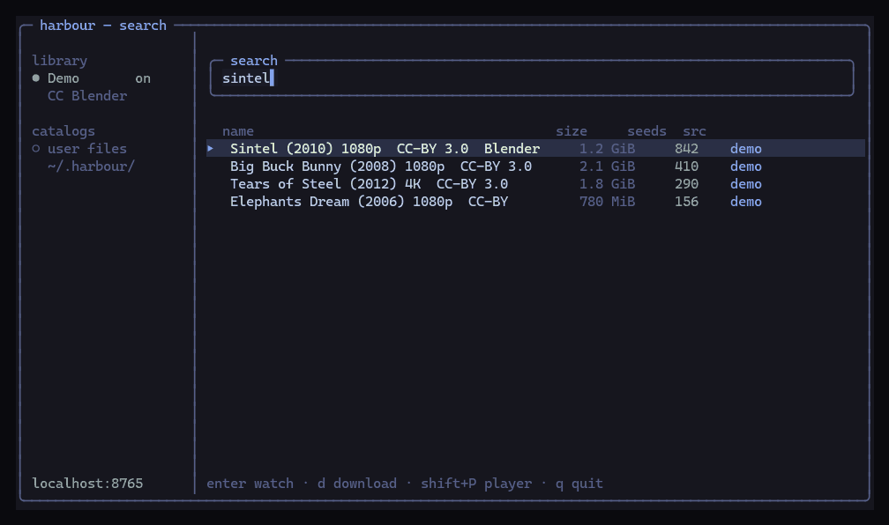
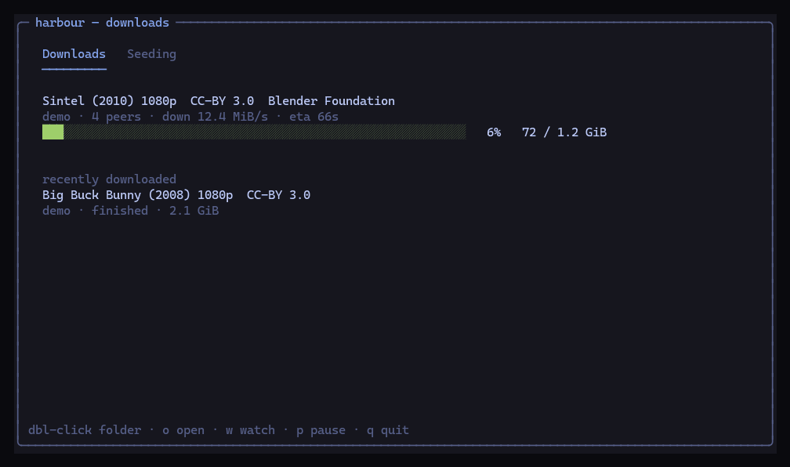
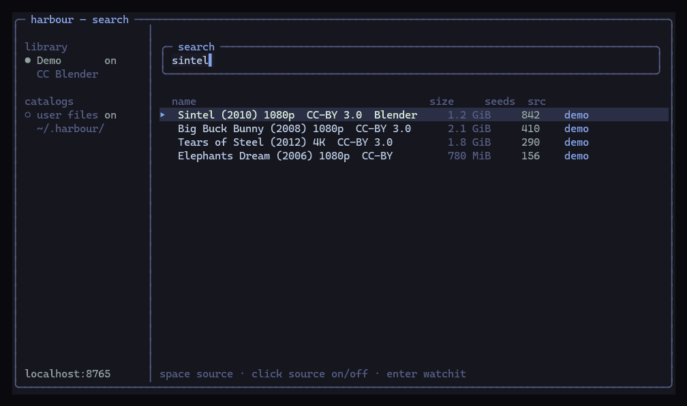
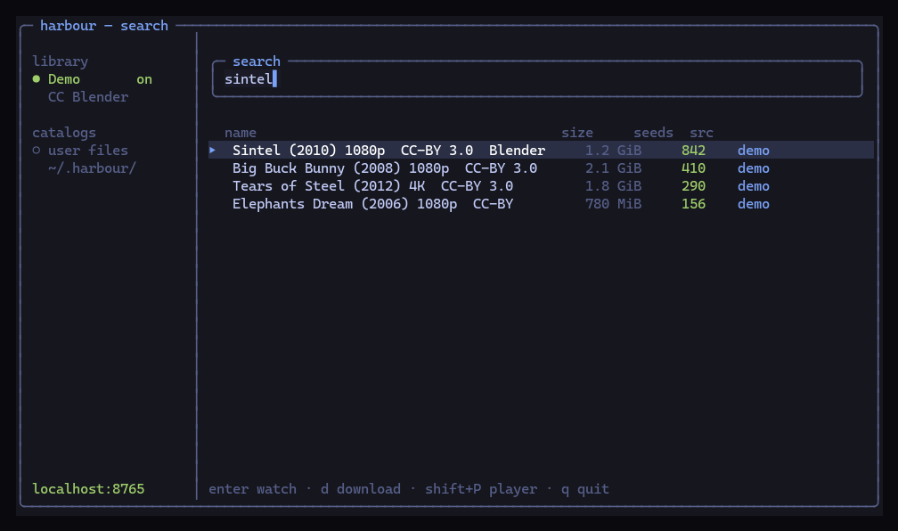
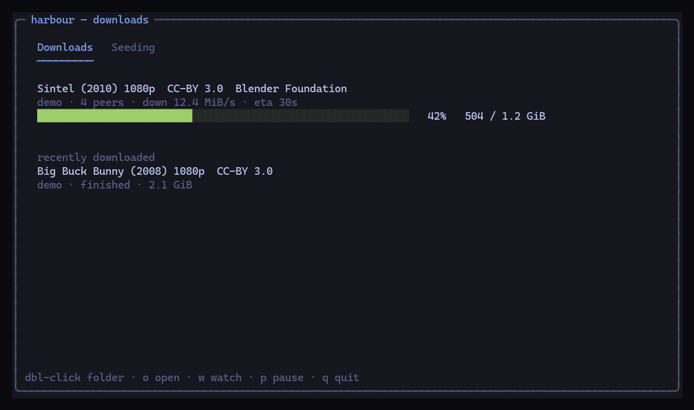
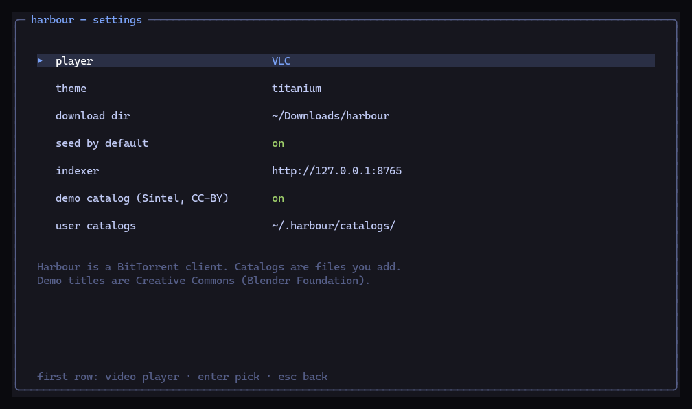
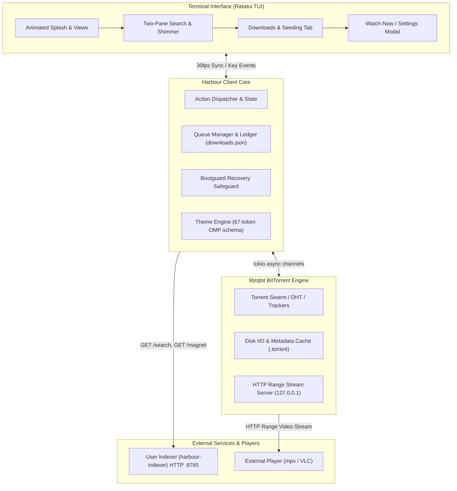

<div align="center">


```text
    __                 __                     
   / /_  ____ ______  / /_  ____  __  _______ 
  / __ \/ __ `/ ___/ / __ \/ __ \/ / / / ___/ 
 / / / / /_/ / /    / /_/ / /_/ / /_/ / /     
/_/ /_/\__,_/_/    /_.___/\____/\__,_/_/      
```

### BitTorrent from your terminal.

**Why people use it** — search, watch, and download in one terminal window. Click a result, pick VLC, and the file starts playing while it still downloads. No browser tabs. The client has no catalogs baked in; you run a local indexer or drop in your own files ([LEGAL.md](LEGAL.md)).

| You get | Why it matters |
| --- | --- |
| **Watch now** | Streams to VLC or mpv on localhost while the swarm fills in. |
| **Search that fans out** | Several sources at once; turn a source off with a click. |
| **A real queue** | Pause, seed, retry, open the folder (double-click). |
| **Mouse + keys** | Click names, press 1–9, or type. `?` is a four-step start guide. |
| **Survives a crash** | Safe Mode on dirty shutdown; the ledger is not silently overwritten. |
| **You own the index** | Protocol-neutral client. Catalogs are yours. |

**Install** — Linux, macOS (Intel + Apple Silicon), and Windows binaries:

[**GitHub Releases**](https://github.com/Ishannaik/harbour/releases) · tag `v*` ships a versioned release · Actions → **release** → Run workflow publishes **nightly**

```bash
# Linux
tar -xzf harbour-linux-x86_64.tar.gz && ./harbour

# macOS Apple Silicon
tar -xzf harbour-macos-aarch64.tar.gz && ./harbour

# macOS Intel
tar -xzf harbour-macos-x86_64.tar.gz && ./harbour
```

Windows: unzip `harbour-windows-x86_64.zip` and run `harbour.exe`.

This archive is the client. Search talks to an indexer you run locally ([LEGAL.md](LEGAL.md)).

**Watching video:** install [VLC](https://www.videolan.org/) (easiest) or `mpv`. The first time you press Enter / `w` on a result, Harbour asks which player to use — **click the name**. Change it later with **Shift+P**, or Settings (first row). Full walkthrough: [docs/GUIDE.md](docs/GUIDE.md).

### First five minutes

1. Run Harbour. Press **Enter** past the splash.
2. Type a name (try `sintel`) and press **Enter**.
3. Click a result, or press **Enter** / **w** to watch.
4. Click **VLC** (or mpv) in the player box. That choice is saved.
5. Press **d** to download instead. **Tab** is the downloads list. **?** is help.

Shots below use the Creative Commons demo catalog (Blender Foundation: Sintel, Big Buck Bunny, Tears of Steel). See [LEGAL.md](LEGAL.md).

<p align="center">
  
</p>
<p align="center">
  
</p>
<p align="center">
  
  
</p>
<p align="center">
  
  
</p>
<p align="center">
  
</p>
<p align="center">
  
</p>
<p align="center">
  
</p>


A high-performance, asynchronous BitTorrent TUI client built in Rust with Ratatui & librqbit.

[](https://www.rust-lang.org/)
[](https://github.com/ratatui/ratatui)
[](https://github.com/ikatson/rqbit)
[](#)
[](#)
[](LICENSE)
[](#stremio-style-addon-architecture)

</div>

---

## Overview

**Harbour** is a modern terminal BitTorrent client engineered for speed, aesthetics, and reliability.
It provides an interactive, keyboard-driven terminal experience with an animated splash sequence,
real-time multi-source search, concurrency-managed download queues with dedicated seeding views,
instant watch-now streaming playback, and full qBittorrent-grade session controls.

Harbour follows the **Stremio / Jackett addon paradigm**: the client is a 100% legal, protocol-neutral
BitTorrent client containing **zero scrapers or index databases**. It interacts with any search provider
implementing the open HTTP `Source` interface (see the [Custom Indexer Guide](docs/indexer-guide.md)).

---

## Features

**Use Harbour if you want a torrent client that lives in the terminal and still feels obvious.** Type a name, click a row, watch or download. That is the product.

- **Watch while it downloads.** Harbour serves the file on `127.0.0.1` and opens **VLC** or **mpv**. First time: click the player name (or press 1–9). Saved after that. **Shift+P** to change.
- **Search from sources you control.** Results come from a local indexer, plus a Creative Commons demo catalog (Blender Foundation). Click a source on the left to turn it off.
- **Downloads and seeding in one list.** Progress bars, pause/resume, retry, remove. Double-click a row to open the folder in Explorer.
- **Mouse is a first-class control.** Click results, click VLC, click sources. Keys still work for people who never lift their hands.
- **Settings in the TUI.** Player, theme, download folder, seed-by-default, indexer URL — no hunting a config file for the first run.
- **Built to not eat your queue.** Atomic `downloads.json`, Safe Mode after a crash, bad state files quarantined instead of overwritten.
- **Rust + librqbit.** DHT, trackers, metadata cache, rate limits, seed-ratio cutoff. Smooth 30fps TUI so bars do not tear.
- **Not a pirate site.** The binary is a client. It does not ship scrapers or an index. See [LEGAL.md](LEGAL.md).

## Architecture



---

## Quickstart & Installation

### Prerequisites
- **Rust Toolchain:** Rust 2024 Edition (MSRV 1.85+)
- **Terminal Emulator:** Any modern terminal with Truecolor support (Windows Terminal, Alacritty, Kitty, WezTerm, Ghostty, iTerm2).
- **Optional Media Player:** `mpv` or `VLC` installed on `PATH` for Watch-Now streaming.

### Windows
Copies `harbour` onto your PATH (`%USERPROFILE%\.harbour\bin`):

```powershell
powershell -ExecutionPolicy Bypass -File install-harbour.ps1
```

Open a new terminal and type `harbour`.

### 1. Build from Source
```bash
# Clone the repository
git clone https://github.com/Ishannaik/harbour.git
cd harbour

# Build an optimized release binary
cargo build --release
```

### 2. Launch Harbour
```bash
# Launch interactive search and queue TUI
cargo run --release

# Or invoke the compiled binary directly
./target/release/harbour
```

### 3. Direct CLI Invocations
Harbour can launch directly into a download from magnet links, infohashes, or local `.torrent` files:
```bash
# Start directly from a magnet URI (always quote magnets to protect shell & characters)
harbour "magnet:?xt=urn:btih:3b245504fb5f3c40d7be923e5900de2957e84d72&dn=Ubuntu"

# Start directly from a 40-character hex infohash
harbour 3b245504fb5f3c40d7be923e5900de2957e84d72

# Start directly from a local .torrent file
harbour /path/to/distro.torrent
```

### 4. Running the Companion Indexer (Optional)
To enable multi-source searching across curated torrent indexes, run a companion indexer service such as [`harbour-indexer`](https://github.com/Ishannaik/harbour-indexer):
```bash
# Run the indexer (binds to http://127.0.0.1:8765 by default)
harbour-indexer
```

---

## Keybindings & Controls

Harbour is designed for rapid, fluid keyboard navigation.

### Global Navigation
| Shortcut | Action | Description |
| :--- | :--- | :--- |
| <kbd>Tab</kbd> | Switch Screen | Toggle between Search and Downloads screens |
| <kbd>?</kbd> | Help Overlay | Display interactive keybinding cheatsheet |
| <kbd>q</kbd> | Quit | Perform a clean, atomic shutdown and exit |
| <kbd>Ctrl</kbd> + <kbd>c</kbd> | Force Quit | Unconditional exit with terminal recovery |

### Search Screen
| Shortcut | Action | Description |
| :--- | :--- | :--- |
| <kbd>Enter</kbd> | Execute Search | Search active query (or browse curated Top Lists if empty) |
| <kbd>↑</kbd> / <kbd>↓</kbd> | Navigate Results | Move selection up / down through search results |
| <kbd>d</kbd> | Default Download | Enqueue selected item to default download folder |
| <kbd>Shift</kbd> + <kbd>d</kbd> | Custom Download | Prompt for a custom destination directory and enqueue |
| <kbd>o</kbd> | Set Output Dir | Change and persist the global default download folder |
| <kbd>w</kbd> | Watch-Now | Stream selected media directly into an external player |
| <kbd>s</kbd> | Open Settings | Open the in-TUI configuration and theme editor |
| <kbd>Esc</kbd> / <kbd>Backspace</kbd> | Return to Input | Refocus the search input field for instant query refinement |

### Downloads & Seeding Screen
| Shortcut | Action | Description |
| :--- | :--- | :--- |
| <kbd>←</kbd> / <kbd>→</kbd> or <kbd>s</kbd> | Toggle Tab | Switch between Active Downloads and Seeding tabs |
| <kbd>↑</kbd> / <kbd>↓</kbd> | Navigate Items | Move selection through the queue ledger |
| <kbd>p</kbd> | Pause / Resume | Toggle transfer state for selected download or seed |
| <kbd>r</kbd> | Retry | Restart a failed transfer from the last verified block |
| <kbd>x</kbd> | Remove | Delete item from ledger (preserves files on disk) |
| <kbd>w</kbd> | Watch-Now | Stream completed / playable item to external player |
| <kbd>Shift</kbd> + <kbd>p</kbd> | Player Picker | Select active streaming player (`mpv`, `vlc`, custom) |
| <kbd>Shift</kbd> + <kbd>s</kbd> | Open Settings | Access global bandwidth and network configuration |

---

## Configuration & Theming

Harbour creates its configuration workspace under `~/.harbour/` (Windows: `%USERPROFILE%\.harbour\`).

### Configuration (`config.toml`)
```toml
# Default directory for completed torrent payloads
download_dir = "~/Downloads"

# Active color theme (titanium, or any custom theme in ~/.harbour/themes/)
theme = "titanium"

# Automatically seed completed torrents
seed_by_default = true

# Upstream search indexer HTTP endpoint
indexer_url = "http://127.0.0.1:8765"

# External media player path (None = auto-detect mpv then vlc)
player = "mpv"

# Bandwidth Limits (in MiB/s, unset = unlimited)
download_limit_mib = 0
upload_limit_mib = 0

# Alternative Rate Limits (toggleable in settings)
use_alt_rates = false
alt_download_limit_mib = 2
alt_upload_limit_mib = 1

# Maximum concurrent active downloads (0 = unlimited)
max_active_downloads = 3

# Automated seeding ratio target (stops seeding when ratio reached)
stop_seed_at_ratio = false
seed_ratio = 1.5

# Network & Swarm discovery
enable_dht = true
enable_upnp = true
listen_port = 6881

# Custom trackers automatically appended to all torrents
trackers = [
  "udp://tracker.opentrackr.org:1337/announce",
  "udp://open.tracker.cl:1337/announce"
]
```

### Theming System
Harbour implements the complete 67-token **omp theme schema**.
- **Titanium (Tokyo Night):** Ships embedded as the default dark theme, utilizing deep midnight canvas (`#16161e`), electric cyan/blue accents (`#7aa2f7`), forest green indicators (`#9ece6a`), and coral warning highlights (`#f7768e`).
- **Custom Themes:** Drop custom JSON themes into `~/.harbour/themes/<name>.json`. Themes support `$var` expansion, ANSI 256 indexing, custom spinner glyphs, and hot-reload live on save.
- **Palette Fallback:** Automatically detects terminal color depth (`Truecolor` vs `256-color`), applying distance-weighted 6x6x6 color cube quantization for legacy terminals.

---

## Environment Variables

| Variable | Default | Description |
| :--- | :--- | :--- |
| `HARBOUR_MAX_DOWNLOADS` | `0` (unlimited) | Concurrency limit for simultaneous active downloads |
| `HARBOUR_SOURCE_TIMEOUT` | `10` | Per-source HTTP timeout in seconds during searches |
| `HARBOUR_STATE_DIR` | `~/.harbour` | Relocate configuration, state ledger, and torrent caches |

---

## Disclaimer

**Harbour is a peer-to-peer file transfer utility and terminal interface implementing the BitTorrent protocol.**
It does not host, index, promote, or distribute any torrent files or copyrighted materials.
The application operates strictly as a neutral network client connecting to user-specified swarms and endpoints.
Users are solely responsible for ensuring that all downloaded and shared content complies with the intellectual property laws and regulations of their jurisdiction.

---

<div align="center">
  <sub>Built with ❤️ in Rust. Released under the <a href="LICENSE">MIT License</a>.</sub>
</div>
