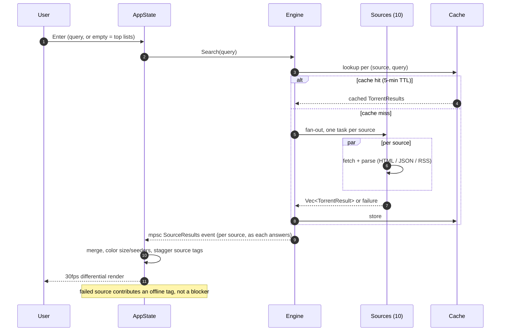
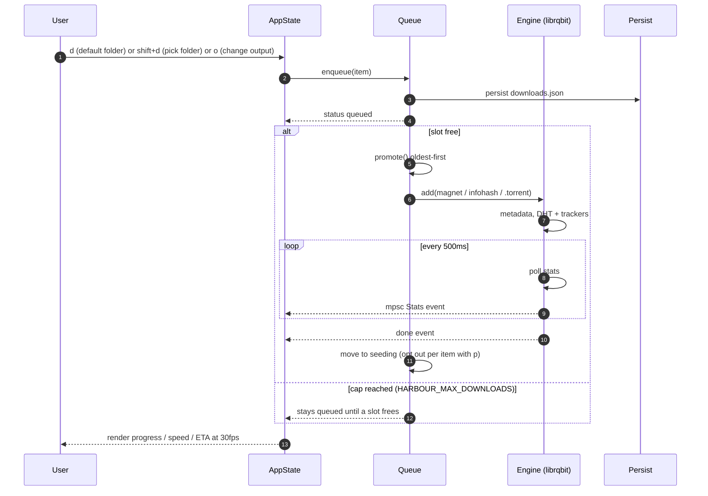

# harbour — architecture

> Status: design document for the intended implementation. The repo has no code
> yet; nothing here describes shipped behavior.
>
> Contract: `C:/tmp/harbour-context.md` is the single source of truth. Every
> name, keybind, and decision below is normative. Identifiers follow Rust
> snake_case (`info_hash`, `size_bytes`, `reports_health`).

## 1. Stolen stacks

harbour is a deliberate mashup of four proven systems. The table says what we
take and what we leave.

| From | We take | Notes |
| --- | --- | --- |
| **torlink** (reference product, TS/Ink) | Queue: unlimited items, concurrency cap, oldest-first `promote()` | cap via `HARBOUR_MAX_DOWNLOADS` env; 0/unset = unlimited |
| | Bootguard: crash marker written at boot; prior run died mid-restore → restore every item paused (safe mode) | no engines start until the user resumes |
| | Metadata capture: save `.torrent` bytes when metadata arrives | re-add/re-seed verifies on-disk files locally, no swarm re-fetch |
| | Stray-download detector: `speed > 0 && progress < 1` for 2 consecutive polls after 10s grace → `missing` | runs against seeding items |
| | `Source` trait + `TorrentResult` shape | `{ id, label, groups, homepage, reports_health, search(query) -> Vec<TorrentResult> }` |
| | Magnet builder: `magnet:?xt=urn:btih:<lowercase infohash>&dn=<name>` | |
| | Multi-host fallback + resilient fetch (retries, per-source timeout, abort signal) | dead source → `offline` tag, never blocks others |
| | CLI modes: `harbour [magnet\|infohash\|.torrent]` launches straight into that download | plus `--help`, `--version` |
| | Sync-exit lifecycle | never wait on engine sockets — OS reclaims them |
| **omp** (harness) | Animation cadence model: 30fps base, coalesced render requests, adaptive backpressure from previous frame cost | |
| | DEC 2026 synchronized output (BSU/ESU) around every frame | zero flicker |
| | Spinner system: 80ms advance (~12.5fps status / ~30fps activity), animated colorizers on status line | |
| | Theme JSON schema ported verbatim | `name`, `colors`, `vars`, `symbols`; see docs/theming.md |
| | Rounded chrome: `╭╮╰╯` borders + tee junctions | |
| **tori** | ratatui + crossterm + libmpv media-integration pattern | external libmpv as renderer, now-playing view; phase 6 watch |
| **librqbit** | Embedded engine (Apache-2.0) | magnet/.torrent/infohash input, metadata, DHT + trackers, stats, seeding, session-state resume |

## 2. Module layout (src/)

```text
src/
├── main.rs       entry: CLI → tokio runtime → bootguard → terminal lifecycle → app loop
├── cli.rs        arg parsing: `harbour [magnet|infohash|.torrent]`, --help, --version
├── ui/           ratatui views + widgets, differential rendering
│   ├── views/    splash, search, downloads (+ Seeding tab), now_playing (phase 6)
│   └── widgets/  sidebar (groups + source-health dots), search bar, results list,
│                 progress bars, status line
├── theme.rs      omp schema port, validation, ~/.harbour/themes loading + live reload,
│                 color-mode detection
├── anim.rs       30fps coalesced render cadence, DEC 2026 BSU/ESU, 80ms spinners,
│                 eased progress bars
├── state.rs      app state: results, queue view, tabs, selection, banners, offline set
├── sources/      Source trait + registry + per-source adapters + net/magnet/cache
│   ├── fitgirl.rs, yts.rs, tpb.rs, x1337.rs, eztv.rs, nyaa.rs, subsplease.rs,
│   │   bittorrented.rs
│   ├── net.rs    resilient fetch: retries, per-source timeout, abort, multi-host fallback
│   ├── magnet.rs magnet builder
│   └── cache.rs  search cache (per (source, query), 5-min TTL) + torrent cache
├── engine.rs     librqbit wrapper: add, metadata capture, 500ms stats poll, seeding control
├── queue.rs      item ledger queued→downloading→failed / seeding→missing; cap + promote()
├── persist.rs    config.toml, downloads.json, history.json (cap 500), cache dirs,
│                 bootguard marker
└── watch.rs      phase 6: librqbit HTTP stream endpoint + libmpv renderer
```

One line each — responsibility + key dependencies:

| Module | Responsibility | Key dependencies |
| --- | --- | --- |
| `main.rs` | Bootstrap + lifecycle: parse CLI, start tokio runtime, bootguard check, enter/exit terminal, run the app loop | tokio, crossterm, cli, theme, anim, state |
| `cli.rs` | Parse `harbour [magnet\|infohash\|.torrent]` and `--help`/`--version` into an initial action | std (hand-rolled; clap only if it grows) |
| `ui/` | Render views from state, translate input into actions; no I/O of its own | ratatui, crossterm |
| `theme.rs` | Load/validate/apply the omp theme schema; live-reload `~/.harbour/themes/*.json`; truecolor detection | serde, serde_json, notify |
| `anim.rs` | 30fps coalesced render loop, DEC 2026 sync output, spinner/easing timers | tokio, crossterm |
| `state.rs` | Single source of truth for drawing; consumes engine events off the mpsc | tokio (mpsc) |
| `sources/` | 10 adapters behind the `Source` trait; search fan-out, multi-host fallback, caching | reqwest, scraper, quick-xml, serde |
| `engine.rs` | Wrap librqbit: add items, capture metadata, poll stats at 500ms, seed/pause/stop | librqbit, tokio |
| `queue.rs` | Item state machine + concurrency cap; oldest-first `promote()` when a slot frees | engine, persist |
| `persist.rs` | Ledger/history/cache files, config, crash marker; atomic writes | serde, serde_json, toml |
| `watch.rs` | Range-served stream endpoint + libmpv playback; now-playing view | axum, libmpv, librqbit |

Open questions: exact event enum shape between engine and state; whether watch
mode embeds libmpv in-process or shells out to `mpv` (tori pattern suggests
in-process libmpv; revisit at phase 6).

## 3. Data flow

### (a) Search — input → source fan-out → results → mpsc → state → render



### (b) Download — add → queue → librqbit → stats poll → events → UI



### (c) Watch — select → stream URL → libmpv (phase 6)

```mermaid
sequenceDiagram
    autonumber
    participant U as User
    participant E as Engine
    participant H as HTTP stream (axum)
    participant M as libmpv
    participant V as NowPlaying view

    U->>E: w on a seeding item
    E->>H: expose Range-served stream URL (librqbit data)
    E-->>U: stream URL
    U->>M: play URL (libmpv is the renderer; no custom engine)
    M->>H: Range GET
    H-->>M: media bytes
    M-->>V: playback state events
    V-->>U: now-playing view at 30fps
```

## 4. Concurrency model

- Single tokio runtime. Everything async and non-blocking; no blocking calls on
  the UI thread.
- One direction of flow: **input → actions → engine → events → mpsc → UI
  state → render**. The UI never talks to the engine directly; the engine never
  draws.
- Render loop: 30fps base cadence with coalesced render requests — if multiple
  state updates land inside one frame they merge — plus adaptive backpressure
  derived from the previous frame's cost. Differential rendering (ratatui's
  diff) writes only changed cells.
- Per-source isolation: each source search runs as its own task with its own
  timeout and abort signal. A dead or slow source marks `offline` in the
  sidebar and never blocks other sources or the UI.
- Downloads: `HARBOUR_MAX_DOWNLOADS` caps concurrent engine items (0/unset =
  unlimited); the queue promotes oldest-first when a slot frees. 500ms stats
  poll per active item, fed onto the same mpsc.
- **Synchronous exit rationale**: on quit we do not await engine sockets,
  tracker connections, or DHT shutdown. The OS reclaims sockets at process
  exit; waiting risks a hang exactly when the user asked to leave. The
  terminal is restored unconditionally first, then the process exits.
- Watch mode (phase 6): libmpv runs its own playback thread; the axum stream
  endpoint is a tokio task. Both feed events to the same state channel.

## 5. Terminal lifecycle

1. **Boot**: parse CLI → write bootguard crash marker → enter alt-screen,
   enable raw mode, hide the hardware cursor (the TUI draws its own).
2. **Render**: every frame is wrapped in DEC 2026 BSU/ESU synchronized output —
   zero flicker. Rounded borders `╭╮╰╯` and tee junctions per the omp chrome.
3. **Restore guarantees**: terminal state (alt-screen, raw mode, cursor) is
   restored unconditionally on exit — normal quit, engine error, or panic.
   Implemented as an RAII guard plus a panic hook so `q`, crash, and Ctrl-C
   all take the same path.
4. **Crash log**: panics write a crash log to disk before restore completes.
5. **Exit**: sync-exit — skip engine socket teardown, let the OS reclaim,
   restore terminal, return.

## 6. Error handling & isolation

| Failure | Behavior |
| --- | --- |
| Source down / scrape error | `offline` tag in sidebar; search continues without it; multi-host fallback tried first |
| Engine error (add, metadata, transfer) | omp errorBanner style banner + item status `failed` with the message |
| Config / theme validation error | loud warning, fall back to defaults (titanium), never a silent default |
| Stray download (files missing) | detector flags `missing` after speed>0 && progress<1 for 2 consecutive polls past a 10s grace period |
| Bootguard: prior run died mid-restore | restore every item paused (safe mode); engines start only on user resume |
| Panic | crash log to file; terminal restored via panic hook |

Isolation principle: no subsystem failure takes down the UI or another
subsystem. Sources are independent tasks; queue and engine communicate only
through typed events; persistence failures surface as a banner, not a fatal.

## 7. Conventions (code comments)

The comment convention is a user requirement and is normative:

- Comments explain **why**, not what (what is evident from code).
- Non-obvious invariants, failure modes, and tradeoffs get a comment at the
  decision site.
- `///` rustdoc on public items; `//` on internals; `TODO`/`FIXME` linked to
  issues where possible.
- Reference style: torlink's `engine.ts` comments (native-port tone), omp's
  `tui-core-renderer.md` invariants.

Rust naming: snake_case identifiers as in the context — `info_hash`,
`size_bytes`, `reports_health`.
